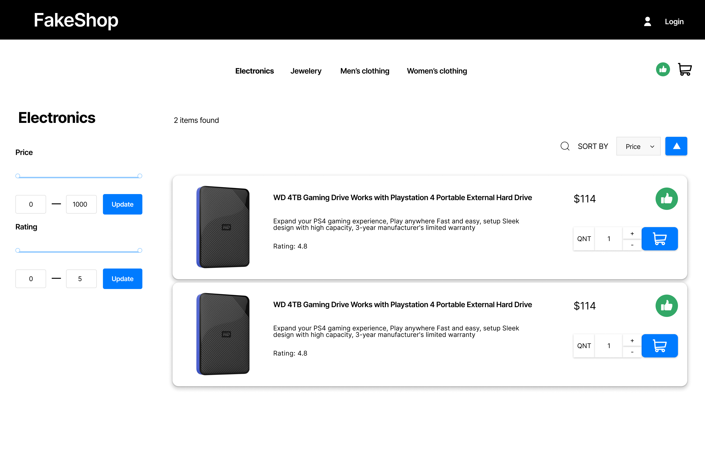

# FakeShop

# FakeShop

FakeShop is een eenvoudige en moderne webshop-applicatie ontwikkeld als eindopdracht voor de Front-end module van de NOV Hogeschool Full Stack Bootcamp opleiding. De applicatie biedt gebruikers de mogelijkheid om producten te bekijken, sorteren, filteren en toe te voegen aan hun winkelmandje.

FakeShop maakt gebruik van de [FakeStore API](https://fakestoreapi.com/) om realistische productgegevens te tonen, zoals titels, prijzen, beschrijvingen en afbeeldingen. Voor het inloggen en registreren van gebruikers maakt de applicatie gebruik van de NOVI backend API op [https://novi.datavortex.nl/](https://novi.datavortex.nl/). 


## Inhoud

- [Functionaliteit](#functionaliteit)
- [Benodigdheden](#benodigdheden)
- [Installatie](#installatie)
- [Inloggegevens](#inloggegevens)
- [Beschikbare npm-commando's](#beschikbare-npm-commando's)

## Functionaliteit

FakeShop biedt de volgende functionaliteiten:
- Producten bekijken, sorteren en filteren op basis van categorie, prijs en beoordeling.
- Zoeken naar producten binnen verschillende categorieën.
- Producten toevoegen aan het winkelmandje.
- Inloggen en registreren van gebruikers.
- Markeren van producten als favoriet (like-functie).

Screenshot van de categoriepagina:



## Benodigdheden

Om deze applicatie lokaal te draaien, heb je de volgende benodigdheden:

- Node.js (versie 14 of hoger aanbevolen)
- Een moderne browser zoals Chrome, Firefox, of Safari
- Voor fakestore API is geen sleutel nodig. De API sleutel voor de NOVI backend staat in de .env map en wordt automatisch geladen door de applicatie. De API key is
   ```bash
  
## Installatie

Volg de onderstaande stappen om FakeShop lokaal te installeren en te draaien:

1. **Clone de repository:**
   ```bash
   git clone git@github.com:peterbokern/fakeshop.git
    ````
    Link naar github repository: <https://github.com/peterbokern/fakeshop>


2. **Navieer naar de project folder**
   ```bash
   cd fakeshop
   
3. **Installeer dependencies**
   ```bash
   npm install
   
4. **Voeg de API sleutel toe aan .env**
    ````bash

## Inloggegevens

Je kunt inloggen met de volgende inloggegevens.

| Gebruikersnaam | Wachtwoord      |
|----------------|-----------------|
| testuser       | TestUser!1      |

> **Opmerking:** Je kunt ook  zelf een account aanmaken.

## Beschikbare npm-commando's

In dit project zijn de volgende npm-commando's beschikbaar:

- **`npm run dev`**: Hiermee kun je de applicatie in de development modus starten. Open [http://localhost:5173](http://localhost:5173) om de applicatie in je browser te bekijken.

- **`npm run build`**: Bouwt de applicatie voor productie naar de `build` map. Deze build is geoptimaliseerd voor betere prestaties.


> **Let op:** Vite gebruikt standaard poort 5173 voor de development server. Als deze poort al bezet is door een andere applicatie, kiest Vite automatisch een andere poort, zoals 5174. Controleer daarom altijd de terminal na het uitvoeren van `npm run dev` om de juiste URL te zien.


